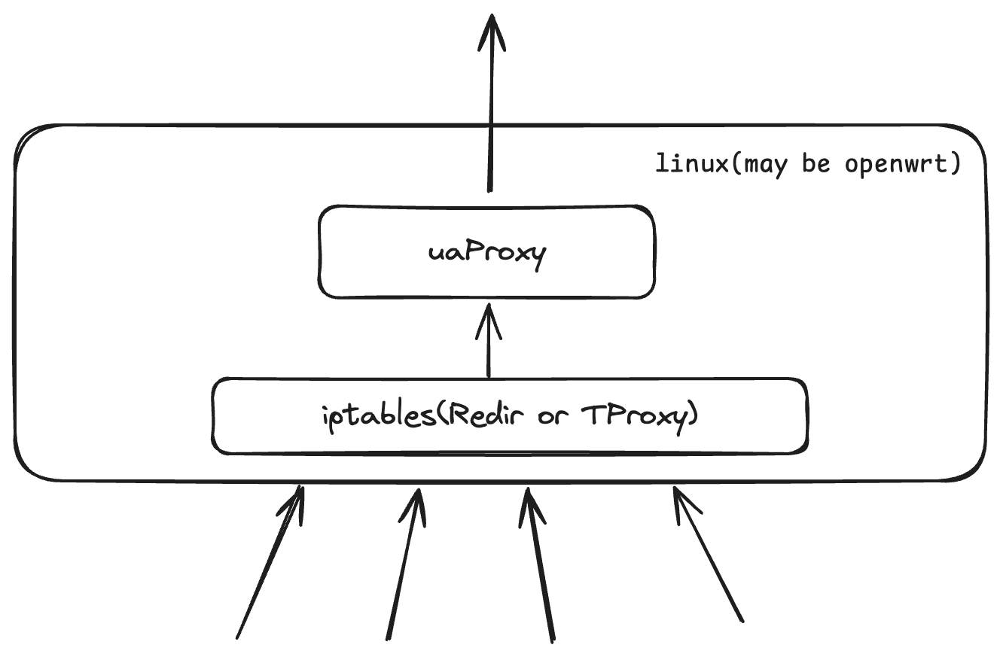
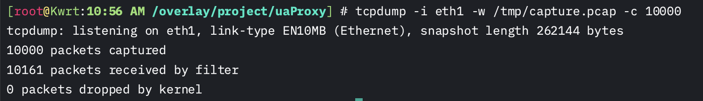
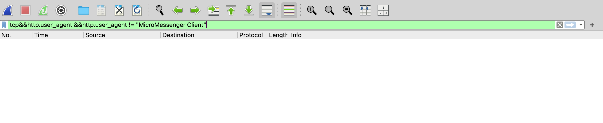

# uaProxy

uaProxy 是一个基于 Go 的高性能代理程序，能够高效监控和修改 HTTP 流量中的 User-Agent，实现隐蔽网络拓扑，并在高并发环境下保持稳定运行。

## 特性

- **高效流量监控**：借鉴 Clash 和 V2Ray 的 `iptables-redir` 方案，uaProxy 能够高效地监控所有网络流量。
- **统一修改 User-Agent**：通过识别并修改 HTTP 流量中的 `User-Agent` 字段，实现对所有 `HTTP` 请求的修改。
- **隐藏网络拓扑**：作为代理程序，uaProxy 天生具备隐藏网络拓扑的能力，避免检测到路由器下连接了多个设备。
- **高并发稳定性**：得益于 Go 语言的高并发性能，uaProxy 能在高负载下保持稳定运行。



## 安装与使用
### 手动安装
1. 网关设备开启 IP 转发。
在 `/etc/sysctl.conf` 文件添加一行 `net.ipv4.ip_forward=1` ，执行下列命令生效：`sysctl -p`

2. 运行uaProxy
  - 下载[相应](https://github.com/huhu415/uaProxy/releases)的压缩包, `tar -xzvf uaProxy-xxx-xxx`解压后
    - 把可执行程序放到`/usr/sbin`目录里面
  - 如果是procd(OpenWrt)**选一个即可**
    - 把[脚本文件](shell/uaProxy.procd)放到`/etc/init.d`目录里面
    - 执行`chmod +x /etc/init.d/uaProxy-openwrt`, 赋予执行权限
      - 执行`/etc/init.d/uaProxy-openwrt enable`, 开机自启
      - 执行`/etc/init.d/uaProxy-openwrt start`, 启动服务
      - (可选)执行`logread | grep uaProxy` 查看日志; 同时也可以登陆web页面, 在`状态-系统日志`里面看
  - 如果是systemd(Linux)**选一个即可**
    - 把[脚本文件](shell/uaProxy.service)放到`/etc/systemd/system`目录里面
    - 使用 `systemctl {start|stop|restart} uaProxy` 控制服务
    - 使用 `systemctl enable uaProxy` 开机自启
    - (可选)使用 `systemctl status uaProxy.service` 查看日志


3. 为了实现所有TCP流量会经过uaProxy, iptables要这样设置
```sh
iptables -t nat -N uaProxy # 新建一个名为 uaProxy 的链
iptables -t nat -A uaProxy -d 192.168.0.0/16 -j RETURN # 直连 192.168.0.0/16
iptables -t nat -A uaProxy -p tcp -j RETURN -m mark --mark 0xff
# 直连 SO_MARK 为 0xff 的流量(0xff 是 16 进制数，数值上等同与上面配置的 255)，此规则目的是避免代理本机(网关)流量出现回环问题
iptables -t nat -A uaProxy -p tcp -j REDIRECT --to-ports 12345 # 其余流量转发到 12345 端口（即 uaProxy默认开启的redir-port）
iptables -t nat -A PREROUTING -p tcp -j uaProxy # 对局域网其他设备进行透明代理
iptables -t nat -A OUTPUT -p tcp -j uaProxy # 对本机进行透明代理, 可以不加, 建议加
```

### 脚本
安装:
```sh
curl https://raw.githubusercontent.com/huhu415/uaProxy/refs/heads/main/shell/Install.sh | sh
```

卸载:
```sh
curl https://raw.githubusercontent.com/huhu415/uaProxy/refs/heads/main/shell/UnInstall.sh | sh
```

### 参数说明:
- `--stats` 开启统计信息
  - 不开启(默认): 修改所有`http`流量的`UA`为统一字段.
  - 开启: 在可执行程序同目录下生成一个`stats-config.csv`文件, 里面记录了不同`User-Agent`字段的访问次数.
    - 如果记录项有`**uaProxy**`前缀, 代表已经检测到特征, 会被修改为统一的UA字段; 否则不会修改.
    - 建议只有在普通模式有问题时, 再开启统计模式, 以免影响性能和反检测效果.


## 测试
在openwrt上的wan口上使用tcpdump抓10000个包


把抓到的包导入到[wireshark](https://www.wireshark.org/)里面,
使用`tcp&&http.user_agent &&http.user_agent != "MicroMessenger Client"`筛选`User-Agent`字段,
发现已经全部改变成功.


> [!NOTE]
> 项目说明:
>
> - 因为是利用了iptables的REDIRECT功能, 所以不能在openwrt上再安装clash, v2ray等软件, 会有冲突.
> - 但这样做也更纯净, 性能最快, 我觉得应该是这个需求的最佳实现方案了.
> - 虽然说不需要解决ipid的反检测, 但本项目会自然而然的解决ipid的反检测.
> - [FAQ](assets/FAQ.md)
