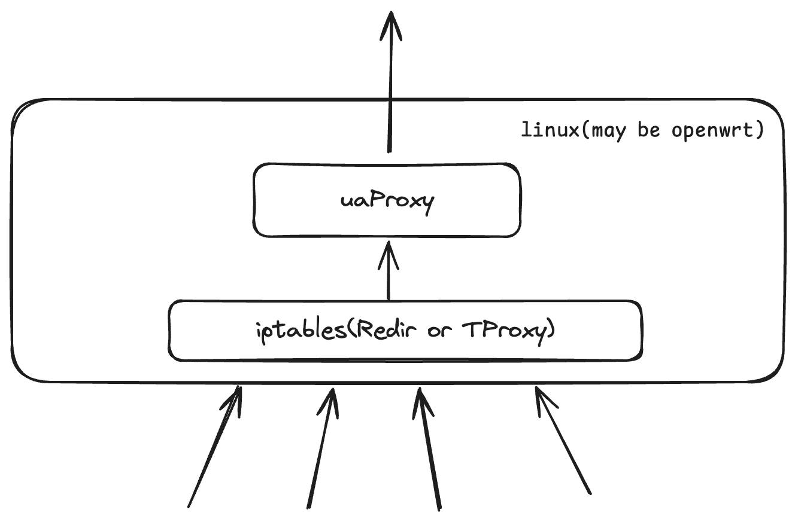

# uaProxy

利用clash, v2ray的方案(iptables-redir)实现对所有流量的监控,
从而找出http流量后, 修改其中的`User-Agent`字段, 从而实现对所有http流量的`User-Agent`修改.


## 方案
### 分析问题
http明文一般都是http/1.1, http/1.0. 所有要针对这两个做调整
- http/1.0: 由于http/1.0是短连接, 所有请求头就只有在tcp握手之后就发送了
- http/1.1: 由于有长连接, 所有在握手之后会发一次, 但下次再发就不会再握手了 _要解决这个问题_

### 解决办法
让http/1.1加上`Connection: close`字段, 这样就会变成http/1.0的短连接, 但这个方案会依靠服务器的支持, 不是所有服务器都支持
但我测试下来, 发现所有服务器都支持, 没找到没改成功的例子. 暂时感觉这个方案可行, 我先放我寝室试一段时间再说. 因为这个方案的性能最好的.

## 使用方法
1. 网关设备开启 IP 转发。
在 `/etc/sysctl.conf` 文件添加一行 `net.ipv4.ip_forward=1` ，执行下列命令生效：`sysctl -p`
2. 为了实现所有TCP流量会经过uaProxy, iptables要这样设置
```sh
iptables -t nat -N uaProxy # 新建一个名为 uaProxy 的链
iptables -t nat -A uaProxy -d 192.168.0.0/16 -j RETURN # 直连 192.168.0.0/16
iptables -t nat -A uaProxy -p tcp -j RETURN -m mark --mark 0xff
# 直连 SO_MARK 为 0xff 的流量(0xff 是 16 进制数，数值上等同与上面配置的 255)，此规则目的是避免代理本机(网关)流量出现回环问题
iptables -t nat -A uaProxy -p tcp -j REDIRECT --to-ports 12345 # 其余流量转发到 12345 端口（即 uaProxy开启的redir-port）
iptables -t nat -A PREROUTING -p tcp -j uaProxy # 对局域网其他设备进行透明代理
iptables -t nat -A OUTPUT -p tcp -j uaProxy # 对本机进行透明代理
```

> ‼️注意, 因为是利用了iptables的REDIRECT功能, 所以不能和clash, v2ray等软件同时使用, 会有冲突.

> 但这样做也更纯净, 性能最快, 我觉得应该是这个需求的最佳实现方案了.


-----------------

## tips

一般使用uaProxy都是为了躲避校园网的多设备检测, 根据需要加上以下规则
```sh
# 防 DNS 污染, 全部走本机的dns查询
iptables -t nat -A PREROUTING -p udp --dport 53 -j REDIRECT --to-ports 53
iptables -t nat -A PREROUTING -p tcp --dport 53 -j REDIRECT --to-ports 53

# 修改出口 TTL 为 64
iptables -t mangle -A POSTROUTING -j TTL --ttl-set 64

# 防时钟偏移检测, 防时间戳检测
iptables -t nat -N ntp_force_local
iptables -t nat -I PREROUTING -p udp --dport 123 -j ntp_force_local
iptables -t nat -A ntp_force_local -d 0.0.0.0/8 -j RETURN
iptables -t nat -A ntp_force_local -d 127.0.0.0/8 -j RETURN
iptables -t nat -A ntp_force_local -d 192.168.0.0/16 -j RETURN
iptables -t nat -A ntp_force_local -s 192.168.0.0/16 -j DNAT --to-destination 192.168.1.1 # 根据你路由器的地址修改

# 差一个IPID检测, 这个先放在这里, 以后再说
```

### NTP服务器地址
- ntp.aliyun.com
- time1.cloud.tencent.com
- time.ustc.edu.cn
- cn.pool.ntp.org
